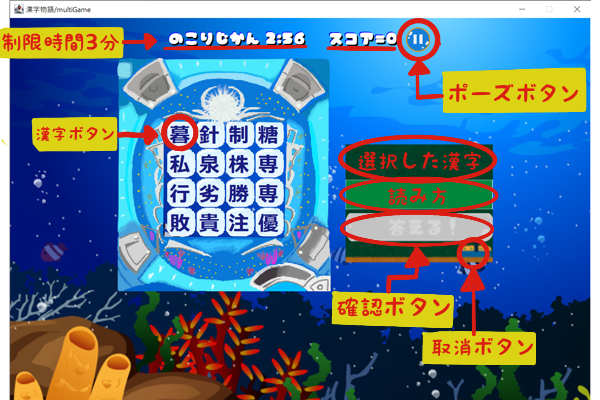
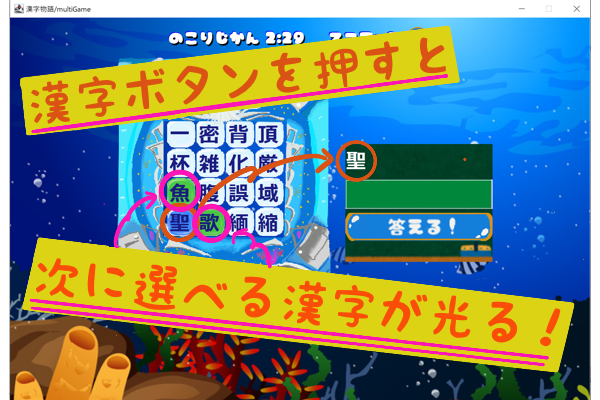
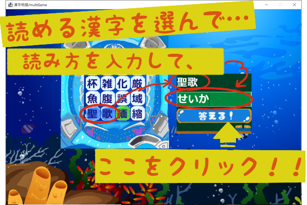
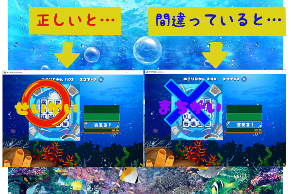
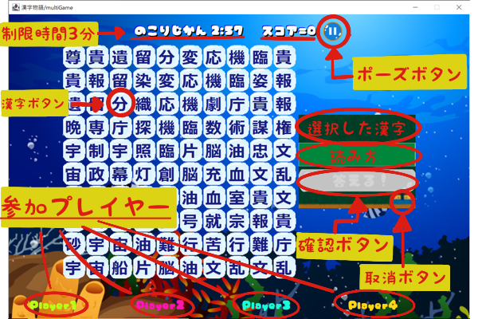
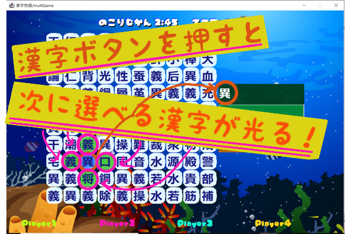
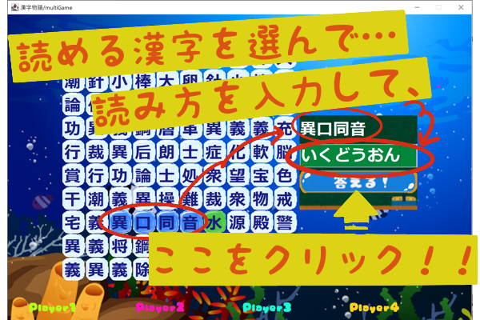
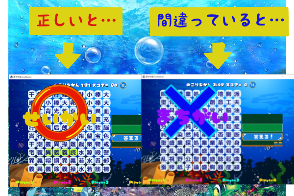

# 1. はじめに

本リポジトリは，学部3年次に行ったアプリの共同開発の授業で制作したゲームのソースコードを置いています．
開発時のリポジトリはプライベートのため，こちらにまるごとコピーしました．

残念ながら，現在はデータベースを削除してしまっているためプレイすることができません．
しかし成果として，どのようなアプリであったかを残したいと考え，こちらを用意しました．

開発メンバーは5人で，私，
[Hiroyuki Okumura](https://github.com/h1royuki229)，
[high-tail](https://github.com/high-tail)，
[Takamichi Wada](https://github.com/wadayamada)と，
マネージャが1人です．

私は，次項で述べますシングルプレイモードのアルゴリズムと実装に携わりました．

# 2. アプリの概要

本アプリは，[日本漢字能力検定](https://www.kanken.or.jp/kanken/)の受検者をターゲットとした，**漢字学習支援のためのパズルゲームアプリ**です．
漢字学習をパズルゲームにしてしまうことで，利用者が楽しく学習を進めることができるのではないかというコンセプトがあります．

利用者ごとに難易度を設定することができ，選択できる難易度は，

* 5級・・・小学校6年生修了程度
* 4級・・・中学校在学程度
* 3級・・・中学校卒業程度
* 準2級・・・高校在学程度
* 2級・・・高校卒業・大学・一般程度

の5段階です．

漢検には「読み」と「書き」がありますが，私たちは「熟語」に注目し，**熟語を正しくを読むことができれば，漢字のブロックを消すことができる**という仕組みでパズルに組み込んでいます．そのためとりわけ「読み」の学習に特化したアプリです．

どのようなパズルゲームなのかは，モードによって異なります．モードは，

* シングルプレイモード・・・1人用
* バトルロワイヤルモード・・・2～4人用，通信に対応

の2つから選択できます．

***

## シングルプレイモード

ゲーム画面は上図です．

パズルは，4×4の漢字が並んだ盤面から縦または横に並んだ熟語を探し出し，その熟語の読み方が正しければ該当の熟語を消すことができるというものです．

消した後は，下向きの重力に従い上のブロックが落ちてきます．つまり，**現在は離れていて読めないけれど，下の熟語を消すことでうまく位置を合わせ，新たな熟語を読むことができる**という状況が発生します．
逆に，今下の熟語を読んで消してしまうと，上の漢字の位置がずれて熟語が読めなくなってしまう，ということも起こり得ます．

熟語は2字～4字を用意しています．盤面から熟語を発見したら，最初の1字をクリックします．すると縦横となりのブロックが光りますので，想定した熟語の方向に1字づつクリックを続けていきます．

右の黒板に熟語の漢字が出揃ったら，下の入力欄にひらがなで読み方を入力します．その後「答える！」ボタンを押します．

読み方が正解であれば，左のジングルとともにブロックが消え，その上のブロックが落ちてきます．間違っている場合は右のジングルとなり，何も起こりません．

実は，この盤面の上には2×4の隠しブロック群が待機しており，熟語を消していくことでその姿を現します．すなわち盤面は6×4のブロック配列のうち，下側の4×4の部分が見えている状態と言えます．

さらに，途中から新しい漢字は出現しません．つまり出現漢字数は6×4=24字で固定です．

そして一番のミソは，この24字，**上手にパズルを消していくことができれば必ず全て消すことができるようになっています**．この「全消し」が最もスコアが高く，シングルプレイモードの最終ゴールです．

プレイヤーには今消していい漢字や後に取っておきたい漢字を仕分けたり，四字熟語のうち2～3字分かった時点で隠れた残り1字を予測したりなど，漢字力とパズル力の双方が問われます．制限時間は3分．「全消し」を目指して頑張ります．

***

## バトルロワイヤルモード

ゲーム画面は上図です．

パズルは，10×10の漢字が並んだ盤面から縦または横に並んだ熟語を探し出し，その熟語の読み方が正しければ該当の熟語を消すことができるというものです．

シングルプレイモードと異なり，重力は発生しておりません．消した後は，その位置に新たな漢字ブロックが入ります．縦横の漢字を考慮し熟語として読めそうな漢字が自動で選ばれ，出現します．

バトルロワイヤルモードの醍醐味は，通信による複数人数同時プレイです．盤面はプレイヤー間でリアルタイムに共有されます．プレイヤーは，いかに速く，たくさんの熟語を探し出せるかが問われます．

熟語は2字～4字を用意しています．盤面から熟語を発見したら，最初の1字をクリックします．すると縦横となりのブロックが光りますので，想定した熟語の方向に1字づつクリックを続けていきます．

右の黒板に熟語の漢字が出揃ったら，下の入力欄にひらがなで読み方を入力します．その後「答える！」ボタンを押します．

読み方が正解であれば，左のジングルとともにブロックが消え，その位置に新たな漢字ブロックが入ります．間違っている場合は右のジングルとなり，何も起こりません．

タッチの差で他のプレイヤーに熟語を取られたり，四字熟語が読めたのに誰かが途中の漢字を消してしまい読めなくなってしまったりと，リアルタイムバトルの面白さが味わえます．制限時間は3分．スコア1位を目指して頑張ります．

# 3. 結び

お読みいただき，ありがとうございました．現在プレイすることはできませんが，面白さが伝わっていると幸いです．